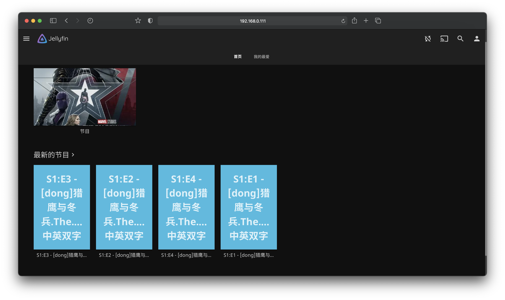

# *jellyfin : base on docker*

## 使用方法

```
➜ docker-compose up -d 
Docker Compose is now in the Docker CLI, try `docker compose up`

Creating network "jellyfin_docker_default" with the default driver
Building jellyfin
[+] Building 79.8s (5/5) FINISHED
···
···
···
···
···

 => => naming to docker.io/library/jellyfin_docker_jellyfin                                                                                                                  0.0s
```



## 