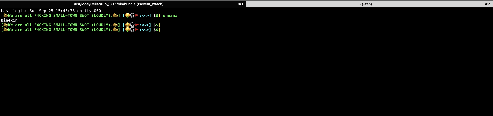

<!-- START doctoc generated TOC please keep comment here to allow auto update -->
<!-- DON'T EDIT THIS SECTION, INSTEAD RE-RUN doctoc TO UPDATE -->
**Table of Contents**  *generated with [DocToc](https://github.com/thlorenz/doctoc)*
<!-- END doctoc generated TOC please keep comment here to allow auto update -->

# Bigger than Bigger

> 大文件存储；供后来者学习以及技术探讨。

- [目录](#%E7%9B%AE%E5%BD%95)
    - [0x01、用友nc6.5反序列化依赖jar包](#0x01%E7%94%A8%E5%8F%8Bnc65%E5%8F%8D%E5%BA%8F%E5%88%97%E5%8C%96%E4%BE%9D%E8%B5%96jar%E5%8C%85)
    - [1x01、*WALL_LISTS*SwitchyOmega使用方法](#1x01wall_listsswitchyomega%E4%BD%BF%E7%94%A8%E6%96%B9%E6%B3%95)
    - [2x01、*Bin4llDocker*](#2x01bin4lldocker)
    - [3x01、*Collection of verified vulnerabilities*](#3x01collection-of-verified-vulnerabilities)
    - [4x01、*CTF*](#4x01ctf)
    - [5x01、*uBlacklist_LISTS*](#5x01ublacklist_lists)
- [注意/ATTENTION PLZ!!!](#%E6%B3%A8%E6%84%8Fattention-plz)

## 目录

### 0x01、用友nc6.5反序列化依赖jar包

- [快速开始](https://github.com/Bin4xin/bigger-than-bigger/tree/master/yonyou-nc6.5-lib#%E7%94%A8%E5%8F%8Bnc65%E5%8F%8D%E5%BA%8F%E5%88%97%E5%8C%96%E4%BE%9D%E8%B5%96jar%E5%8C%85)
- 部分依赖jar包在安装完nc6.5系统后，一般在`C://yonyou//home//lib//`目录下，前提需要有nc6.5的安装包；或者下载仓库内的依赖包：
    - *[点击以了解yonyou-nc6.5-lib](https://github.com/Bin4xin/bigger-than-bigger/blob/master/yonyou-nc6.5-lib/README.MD)*
- 本机运行环境
    - `java version "1.8.0_181"/javac 1.8.0_181`
- 学习教程[*README*](https://github.com/Bin4xin/bigger-than-bigger/blob/master/yonyou-nc6.5-lib/README.MD)
- 下载
    - 单jar包：点击[*ncdepend.jar*](https://github.com/Bin4xin/bigger-than-bigger/blob/master/yonyou-nc6.5-lib/ncdepend.jar)链接 -> Download.
    - 整包[*yonyou-NCv6.5-lib.zip*](https://github.com/Bin4xin/bigger-than-bigger/releases/tag/yonyou-ncv6.5)链接 -> 单击链接下载 

### 1x01、*WALL_LISTS*SwitchyOmega使用方法

- auto switch
- 规则列表设置 -> AutoProxy
- 规则列表网址 -> `https://raw.githubusercontent.com/Bin4xin/bigger-than-bigger/master/WALL_LISTS/lists.txt`
- 立即更新
- 参考链接
    - *[gfwlist/gfwlist](https://github.com/gfwlist/gfwlist)*

### 2x01、*Bin4llDocker*

    - 🚧UNDER CONSTRUCTION🚧

### 3x01、*Collection of verified vulnerabilities*

- *C(ollection) O(f) V(erified) V(ulnerabilities)*
    - 记录已复现所有web、中间件相关漏洞、payload
    - 洞察相关漏洞、payload的产生原因、区别
    - *Power by Bin4xin*
    - [more...](https://github.com/Bin4xin/bigger-than-bigger/blob/master/CoVV/README.MD)

### 4x01、*CTF*

- 个人CTF比赛复盘文件共享；更多请[点击此处](https://github.com/Bin4xin/bigger-than-bigger/tree/master/CTF)了解。

### 5x01、*uBlacklist_LISTS*

- 来源：[@YeSilin/uBlacklist](https://github.com/YeSilin/uBlacklist){:target="_blank"}
- 订阅更新：

```
https://raw.githubusercontent.com/Bin4xin/bigger-than-bigger/master/uBlacklist_LISTS/lists.txt
```

### 6x01、robbyrussell.zsh-theme

```bash
declare -a expressions=(
'📣What are Y0u f4cking barking.📣'
'📣We are all F4CKING SMALL-TOWN SWOT (LOUDLY).📣'
'~~APPEARANCE IS THE FIRST PRODUCTIVE FORCE~~;'
)
random_index=$(($RANDOM % ${#expressions[@]}))
index=$((1 + $random_index))
selected_expression=${expressions[index]}

PROMPT="%(?:%{$fg_bold[green]%}[`echo $selected_expression`] :%{$fg_bold[red]%}[Ooooooops @@S0mething WROOONG@@] )"
PROMPT+='%{$fg[cyan]%}[🤑🎧🚩:<%c>]%{$reset_color%}$(git_prompt_info) %{$fg_bold[white]%}$%{$fg_bold[green]%}$%{$fg_bold[yellow]%}$ '

ZSH_THEME_GIT_PROMPT_PREFIX="%{$fg_bold[yellow]%}[%{$fg_bold[blue]%}<git:%{$fg[red]%}"
ZSH_THEME_GIT_PROMPT_SUFFIX="%{$reset_color%}%{$fg_bold[yellow]%}]"
ZSH_THEME_GIT_PROMPT_DIRTY="%{$fg[blue]%}>%{$fg[yellow]%}"
ZSH_THEME_GIT_PROMPT_CLEAN="%{$fg[blue]%}>"
```

效果


# 注意/ATTENTION PLZ!!!

- 1.由于传播、利用此库/文所提供的信息而造成的任何直接或者间接的后果及损失，均由使用者本人负责，本文作者不为此承担任何责任。
- 2.转载请申明出处：*[Bigger than Bigger](https://github.com/Bin4xin/bigger-than-bigger)*
- i.Any direct or indirect consequences and losses caused by the dissemination and use of the information provided by this library/text are the responsibility of the user himself, and the author of this article does not bear any responsibility for this.
- ii.Please state the source for reprinting : *[Bigger than Bigger](https://github.com/Bin4xin/bigger-than-bigger)*
