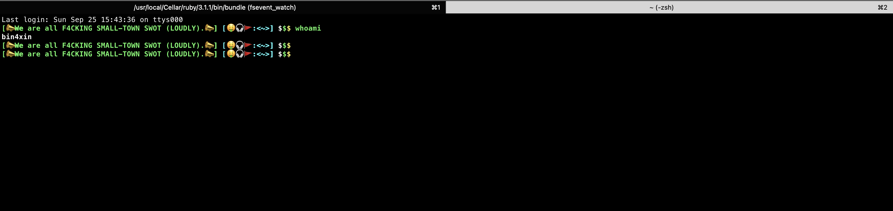

<div align="center">

# 📦 Bigger than Bigger

<sub>大文件存储 · 供后来者学习以及技术探讨</sub>

<br>


</div>

---

## 📂 目录

| 编号 | 模块 | 说明 |
|:---:|:---|:---|
| `0x01` | [用友 NC6.5 反序列化依赖 JAR 包](#0x01-用友-nc65-反序列化依赖-jar-包) | Deserialization 依赖库 |
| `1x01` | [SwitchyOmega 使用方法](#1x01-switchyomega-使用方法) | WALL_LISTS 自动切换规则 |
| `2x01` | [Bin4llDocker](#2x01-bin4lldocker) | 🚧 Under Construction |
| `3x01` | [Collection of Verified Vulnerabilities](#3x01-collection-of-verified-vulnerabilities) | CoVV · 已复现漏洞/POC 集 |
| `4x01` | [CTF](#4x01-ctf) | CTF 比赛复盘文件 |
| `5x01` | [uBlacklist_LISTS](#5x01-ublacklist_lists) | 搜索黑名单订阅源 |
| `6x01` | [robbyrussell.zsh-theme](#6x01-robbyrussellzsh-theme) | 自定义 oh-my-zsh 主题 |

---

## 0x01 · 用友 NC6.5 反序列化依赖 JAR 包

部分依赖 JAR 包在安装完 NC6.5 系统后，一般位于 `C://yonyou//home//lib//` 目录下（前提需有 NC6.5 安装包）；或直接下载仓库内依赖包：

- 📖 [快速开始 & README](https://github.com/Bin4xin/bigger-than-bigger/tree/master/yonyou-nc6.5-lib#%E7%94%A8%E5%8F%8Bnc65%E5%8F%8D%E5%BA%8F%E5%88%97%E5%8C%96%E4%BE%9D%E8%B5%96jar%E5%8C%85)
- ☕ 运行环境：`java version "1.8.0_181"` / `javac 1.8.0_181`
- 📥 单 JAR 包：[ncdepend.jar](https://github.com/Bin4xin/bigger-than-bigger/blob/master/yonyou-nc6.5-lib/ncdepend.jar)
- 📥 整包：[yonyou-NCv6.5-lib.zip](https://github.com/Bin4xin/bigger-than-bigger/releases/tag/yonyou-ncv6.5)

---

## 1x01 · SwitchyOmega 使用方法

配置 AutoSwitch 自动切换规则：

```
规则列表设置  → AutoProxy
规则列表网址  → https://raw.githubusercontent.com/Bin4xin/bigger-than-bigger/master/WALL_LISTS/lists.txt
```

> 参考：[gfwlist/gfwlist](https://github.com/gfwlist/gfwlist)

---

## 2x01 · Bin4llDocker

> 🚧 **UNDER CONSTRUCTION** — 敬请期待

---

## 3x01 · Collection of Verified Vulnerabilities

**C**ollection **o**f **V**erified **V**ulnerabilities · `CoVV`

- 记录已复现所有 Web / 中间件相关漏洞及 Payload
- 洞察相关漏洞、Payload 的产生原因与区别
- Power by Bin4xin

> 📖 [完整列表 → CoVV/README.MD](https://github.com/Bin4xin/bigger-than-bigger/blob/master/CoVV/README.MD)

---

## 4x01 · CTF

个人 CTF 比赛复盘文件共享。

> 📖 [CTF 文件夹](https://github.com/Bin4xin/bigger-than-bigger/tree/master/CTF)

---

## 5x01 · uBlacklist_LISTS

搜索黑名单订阅列表。

> 来源：[@YeSilin/uBlacklist](https://github.com/YeSilin/uBlacklist)

---

## 6x01 · robbyrussell.zsh-theme

自定义 oh-my-zsh 主题，内置随机毒鸡汤提示语：

```bash
declare -a expressions=(
'📣What are Y0u f4cking barking.📣'
'📣We are all F4CKING SMALL-TOWN SWOT (LOUDLY).📣'
'~~APPEARANCE IS THE FIRST PRODUCTIVE FORCE~~;'
)
random_index=$(($RANDOM % ${#expressions[@]}))
index=$((1 + $random_index))
selected_expression=${expressions[index]}

PROMPT="%(?:%{$fg_bold[green]%}[`echo $selected_expression`] :%{$fg_bold[red]%}[Ooooooops @@S0mething WROOONG@@] )"
PROMPT+='%{$fg[cyan]%}[🤑🎧🚩:<%c>]%{$reset_color%}$(git_prompt_info) %{$fg_bold[white]%}$%{$fg_bold[green]%}$%{$fg_bold[yellow]%}$ '

ZSH_THEME_GIT_PROMPT_PREFIX="%{$fg_bold[yellow]%}[%{$fg_bold[blue]%}<git:%{$fg[red]%}"
ZSH_THEME_GIT_PROMPT_SUFFIX="%{$reset_color%}%{$fg_bold[yellow]%}]"
ZSH_THEME_GIT_PROMPT_DIRTY="%{$fg[blue]%}>%{$fg[yellow]%}"
ZSH_THEME_GIT_PROMPT_CLEAN="%{$fg[blue]%}>"
```

效果预览：



---

<div align="center">

### ⚠️ 注意 / ATTENTION

</div>

| 🇨🇳 中文 | 🇬🇧 English |
|:---|:---|
| 由于传播、利用此库/文所提供的信息而造成的任何直接或者间接的后果及损失，均由使用者本人负责，本文作者不为此承担任何责任。 | Any direct or indirect consequences and losses caused by the dissemination and use of the information provided by this library/text are the responsibility of the user himself, and the author does not bear any responsibility. |
| 转载请申明出处：[Bigger than Bigger](https://github.com/Bin4xin/bigger-than-bigger) | Please state the source for reprinting: [Bigger than Bigger](https://github.com/Bin4xin/bigger-than-bigger) |

<div align="center">

<sub>© 2020-2026 Bin4xin · <a href="https://github.com/Bin4xin/bigger-than-bigger">Bigger than Bigger</a></sub>

</div>
