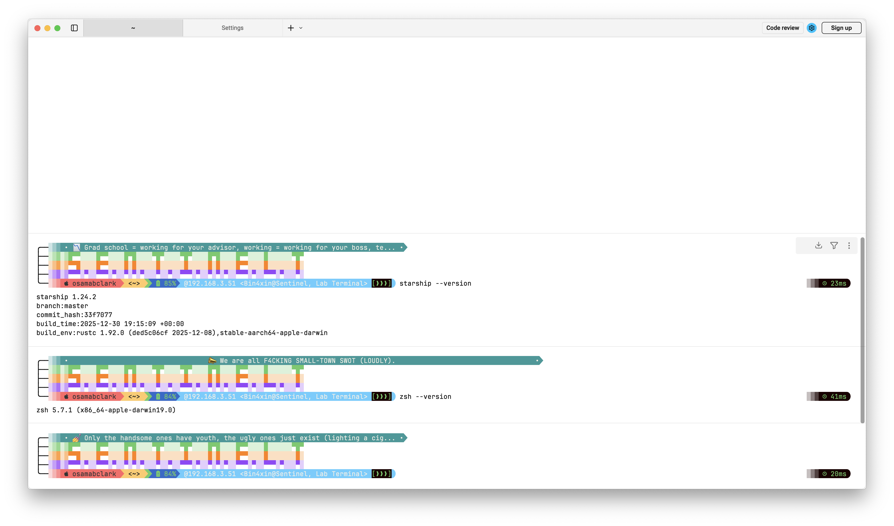

# ENV

- SHELL
```bash
zsh --version
zsh 5.7.1 (x86_64-apple-darwin19.0)
```
- TERMINAL SOFTWARE
    - `WARP v0.2026.03.18.08.24.stable_01`
    - starship: `starship --version 1.24.2`

# USAGE

1. zhsrc -> `~/.zshrc`
2. starship.toml -> `~/.config/starship.toml`
3. random-slogan.sh -> `~/.config/starship/random-slogan.sh`
3. run:

```bash
source ~/.zshrc
```



# ENJOY :D